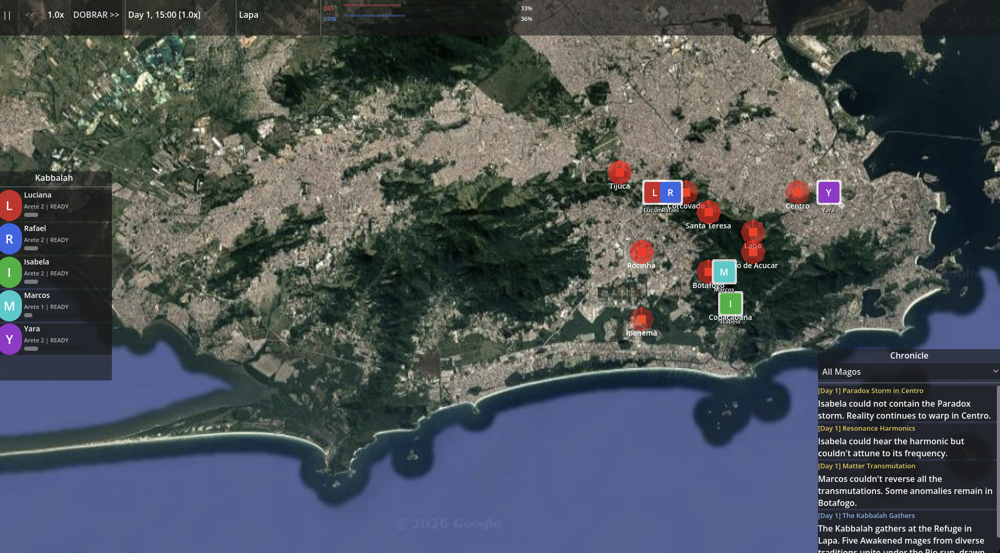

# SimKaballah



A strategy simulation game built in **Godot 4.6**, inspired by *Mage: The Ascension*. Guide a cabal (Kabbalah) of five Awakened mages through the streets of Rio de Janeiro, resolving supernatural encounters, managing cosmic balance, and pursuing the ultimate goal: Ascension.

## Premise

Rio de Janeiro pulses with unseen magical energy. Reality fractures at Copacabana, spirits surge through Tijuca Forest, and Technocracy agents lurk in Lapa. Your Kabbalah — five mages from diverse magical traditions — must navigate these threats, grow in power, and maintain the cosmic balance between Creation, Destruction, and Conservation.

**Win condition:** Advance any mage to Arete 10 to achieve Ascension.

## Core Systems

### Map & Navigation
- Satellite map of Rio with 10 real locations (Copacabana, Ipanema, Botafogo, Pao de Acucar, Centro, Lapa, Santa Teresa, Tijuca, Corcovado, Rocinha)
- Gold path lines show connections between locations
- Click a location to travel there (BFS pathfinding)
- Individual mago tokens on the map, colored by tradition

### Time & Speed
- Game time progresses automatically (1 real second = 3 game minutes at 1x)
- **Dobrar** (double) mechanic: keep doubling speed up to 128x
- Halve speed back down, pause/unpause with `||` button or `Esc`
- System ticks every 5 game-minutes trigger encounter spawns and cosmic drift

### Encounters
- 25+ unique encounters across all locations (Story, Random, Combat, Find Node, Cosmic Balance, Find Mago types)
- Encounters appear as pulsing red indicators on locations
- Move a mage to an encounter location to engage
- Deploy up to 3 mages per encounter
- Resolution tests **attributes** (Strength, Dexterity, Stamina, Charisma, Manipulation, Appearance, Intelligence, Wits, Perception) vs. difficulty
- Relationship bonds between co-deployed mages grant skill bonuses
- Some encounters offer **dilemma choices** with different stats, difficulties, and cosmic impacts

### Mage Progression
- **Arete** (1-10): Core magical enlightenment. Costs `arete x 100` XP to advance.
- **9 Spheres** (0-5 each): Correspondence, Entropy, Forces, Life, Matter, Mind, Prime, Spirit, Time
  - Ranks: Uninitiated, Initiate, Apprentice, Disciple, Adept, Master
  - Costs `(current + 1) x 50` XP to advance
- **Attributes** (9 total): Physical, Social, and Mental categories
- **Status tracking**: Health, Stamina, Paradox levels

### Cosmic Balance
- Three cosmic tendencies: **Creation**, **Destruction**, **Conservation** (sum to 100%)
- Drifts randomly over time toward one tendency
- **Crisis** triggers when any tendency exceeds 60%
  - Creation crisis: +50% encounter spawn rate
  - Conservation crisis: -50% spawn rate and XP
  - Destruction crisis: health damage on encounter failure
- Successful encounters shift the balance via cosmic impact
- Ascension resolves any active crisis

### Chronicle
- Living history log of all significant events
- Opening narrative, encounter outcomes, advancements, cosmic crises, travel, and ascension
- Filter by mage or view all entries

## The Five Starting Mages

| Name | Tradition | Arete | Key Spheres |
|------|-----------|-------|-------------|
| Luciana | Order of Hermes | 2 | Forces 2, Prime 1, Correspondence 1 |
| Rafael | Akashic Brotherhood | 2 | Mind 2, Life 1, Forces 1 |
| Isabela | Verbena | 2 | Life 3, Spirit 1, Prime 1 |
| Marcos | Virtual Adepts | 1 | Correspondence 2, Forces 1, Matter 1 |
| Yara | Dreamspeakers | 2 | Spirit 3, Mind 1, Entropy 1 |

## UI Overview

- **HUD** (top): Time/speed controls, location name, cosmic bars (CRI/DES/CON with percentages), alert messages
- **Party Panel** (side): Mage roster with tradition-colored circle portraits, click to open character sheet
- **Mago Sheet** (popup): Full character stats, sphere diamonds with rank names, advancement buttons
- **Encounter Panel** (popup): Deploy mages, view success probability, resolve encounters
- **Chronicle Panel**: Scrollable event history
- **Cosmic Panel**: Detailed cosmic state visualization

## Project Structure

```
autoloads/          # Global singletons (GameClock, PartyManager, EncounterManager, etc.)
resources/          # Data classes (MagoStats, EncounterDef, ChronicleEntry, etc.)
scenes/
  main/             # Main game scene and orchestrator
  map/              # Rio map, location markers, mago tokens, camera
  ui/               # HUD, party panel, mago sheet, time controls, chronicle
  encounters/       # Encounter panel, deployment slots
  fx/               # Visual effects (paradox, ascension)
scripts/            # Utility classes (TrialResolver, Enums)
map_images/         # Satellite map of Rio de Janeiro
```

## Controls

- **Left-click** mage token: Select mage
- **Left-click** location (with mage selected): Move mage there
- **Scroll wheel**: Zoom map
- **Middle/Right-click drag**: Pan map
- **Esc**: Toggle pause
- **Drag** mage from roster to encounter slot: Deploy for encounter

## Tech

- Godot 4.6
- GDScript
- No external dependencies
